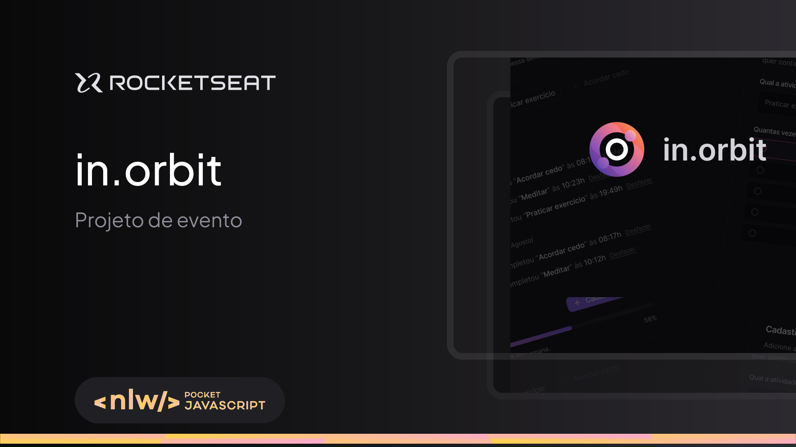

# Frontend - NLW Pocket: Full-stack Intermediário

**Descrição:**
No front-end, criei uma aplicação em ReactJS, colocando em prática conceitos como Propriedades, Estados e Componentes, utilizando TypeScript para tipagem, Vite para um ambiente de desenvolvimento rápido, TailwindCSS para interface responsiva, e fiz o consumo de API com o back-end em Node.js. Além disso, gerenciei dados assíncronos com TanStack Query.

**Tecnologias:**
* React
* TypeScript
* ViteJs
* TailwindCSS
* TanStack Query
* Zod
* React Hook Form

## 👨‍💻 Colaboradores

<table>
    <tr>
         <td align="center"><a href="https://brunogoncalvesferreira.com"> <b>Bruno Gonçalves</b></a> <a href="https://brunogoncalvesferreira.com" title="Bruno Gonçalves Ferreira">👨‍🚀</a></td>
    </tr>
</table>